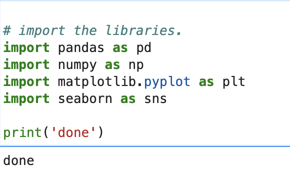
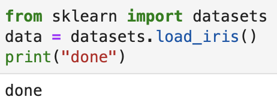
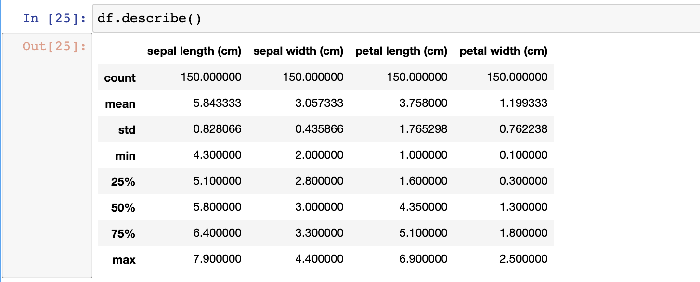

# Pands-Project
 
The Irish Flower Data Set is a set of 150 entries of a specific flower.

3 different Iris species:
Iris Setosa
Iris Versicolor
Iris  

sepal is the stem
petal is the main portion of the flower

## Importing the Libraries
For this project I am using Pandas, Numpy, Matplotlib and Seaborn. 




## Importing the Dataset
To import the dataset I first installed sklearn through the terminal using pip. Then I imported the iris dataset from sklearn's datasets library.




## Getting Familiar With The Data
After loading the data is set the dataframe to df.
``` df = pd.DataFrame(data["data"], columns=data["feature_names"]) ```

Then I got a basic description of the dataset. It showed some basic statistics of the 4 features. Although it is a basic description it still gives some interesting information. For example that there is a big difference between the smallest petal length and the largest. There isn't as large a range in petal width.




From here I wanted to get to know the data further. I felt a histogram was a good place to start.

## Histograms
The histogram shows the distribution between each variable for a specific characteristic.

I have saved the histograms program in the repository under Histograms.py. I also saved the plots as pngs and placed them into a separate folder within the repository.

``` 
col = "sepal length (cm)"
df[col].hist( color = "green")  
plt.suptitle('Sepal Length in CM')
plt.xlabel("sepal Length in cm")
plt.ylabel("count")
plt.savefig('ImageFolder/SepalLengthHist.png') 
```


