# Pands 2021 Project 
Student Name: John Cashman
&nbsp;
Student Id: G0039261

&nbsp;

# Fisher's Iris Dataset :leaves: :herb: :bar_chart:

### Table of contents
1. [Introduction](#Introduction)
2. [Set Up](#Setup)
3. [Checking the dataset](#Checking)
4. [Getting Familiar](#Familiar)
5. [More extensive analysis](#analysis)
6. [Conclusion](#conclusion)


## Introduction <a name="introduction"></a>

Fisher's Iris Data Set was first introduced by Ronald Fisher in his 1936 report titled ["The Use of Multiple Measurements in Taxonomic Problems"](https://onlinelibrary.wiley.com/doi/epdf/10.1111/j.1469-1809.1936.tb02137.x). It consists of 50 records for each of three Iris species: Iris setosa, Iris virginica, and Iris versicolor. Each flower has 4 measurements applied to it: sepal length, sepal width, petal length and petal width. The sepal is the outer part of the flower, it encloses the flower during bud stage and the petal is the main leaflike part of the flower, it is often the colourful part.
In doing this project my aim was to analyse the dataset and draw some insight about the differences between the 3 species within the Iris flower family.


&nbsp;
## Set Up  <a name="Setup"></a>

#### Importing the Libraries
For this project I used Pandas, Numpy, Matplotlib and Seaborn. I installed all the libraries into my machines through pip before starting the project. After importing I printed done just so I know that it has worked.

```
import pandas as pd
import numpy as np
import matplotlib.pyplot as plt 
import seaborn as sns
print('done')
```


&nbsp;
#### Importing the Dataset
To import the dataset I first installed sklearn through the terminal using pip. Then I imported the iris dataset from sklearn's datasets library.

```
from sklearn import datasets
data = datasets.load_iris()
print("done")
```


&nbsp;
## Checking the dataset <a name="Checking"></a>
To make sure the dataset I dowloaded was good I did a few checks on it. I have saved this program under [cleaning.py](https://github.com/john-cashman/Pands-Project2021/blob/main/cleaning.py). I checked the dataset for any misssing values, duplicates and the species count. Before downloading the dataset I knew there should be no missing values and the species count is 50 of each.
  

&nbsp;
#### Missing Values
```
print(df.isnull().sum(axis=0))
```

The result showed that there were no missing values.
&nbsp;
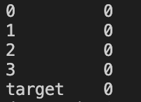


&nbsp;
#### Check for Duplicates
Checking the dataset for duplicates.

```
print(df.duplicated().sum()) #This tells the number of duplicates.

print(df[df.duplicated()]) #This tells me where the duplicate occurs.

```
There is one duplicate occuring on line 142. After researching the duplicate I decided to keep the duplicate in the dataset as removing it would create an imbalance. 


&nbsp;
#### Dataset shape:
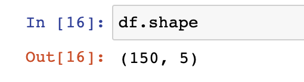

The dataset has 150 data-points and 4 features. It also has a class label for the species on the horizontal line. The 4 features are:

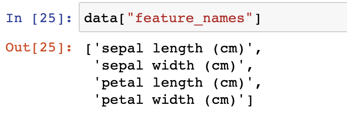

&nbsp;
#### Species count
```
plt.title('species count')
sns.countplot(df['target']);
```


The dataset is well balanced with 50 of each species. At this stage I hadn't applied the names to the species but 0 is the Setosa, 1 is versicolor and 2 is virginica. Later on I matches these species to their numbers.


&nbsp;
## Getting Familiar With The Data <a name="Familiar"></a>
After loading the data I set the dataframe to df.


``` 
df = pd.DataFrame(data["data"], columns=data["feature_names"]) 
```

Then I got a basic description of the dataset.


 It showed some basic statistics of the 4 features. Although it is a basic description it still gives some interesting information. For example that there is a big difference between the smallest petal length and the largest. Sepal length also ranges significantly. From here I wanted to get to know the data further. I felt a histogram was a good place to start.


&nbsp;
#### Histograms
The histogram shows the distribution between each variable for a specific characteristic.

I have saved the histograms program in the repository under [Histograms.py](https://github.com/john-cashman/Pands-Project2021/blob/main/Histograms.py). I also saved the plots as pngs and placed them into a separate folder within the repository. Although the histogram doesn't give too much detail there is still some parts that stand out. For example, the petal length has a significant count at the lowest measurements. This may suggest that one species of Iris has a much shorter petal length.

I used the following code to generate the histograms. I then changed the 'col' accordingly.
``` 
col = "sepal length (cm)"
df[col].hist( color = "green")  
plt.suptitle('Sepal Length in CM')
plt.xlabel("sepal Length in cm")
plt.ylabel("count")
plt.savefig('ImageFolder/SepalLengthHist.png') 
```


&nbsp;

&nbsp;


&nbsp;

&nbsp;


&nbsp;

&nbsp;

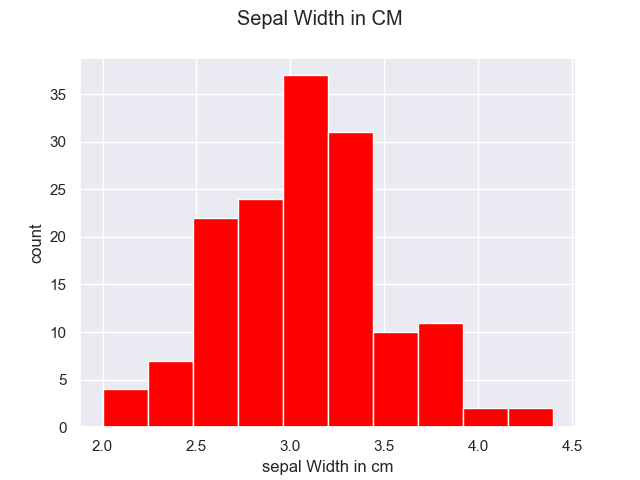
  

&nbsp;

&nbsp;


#### Assigning Names to targets 

At this stage I realised I needed to put a name on the different species. Prior to this the species were labeled as 0,1 and 2.

This printed the names of the targets.


This assigned the names. Then I printed the dataset so I knew it worked correctly.


&nbsp;

&nbsp;

## More extensive analysis <a name="analysis"></a>
After setting target names I could get more in depth with the analysis. In my analysis I created relational plots, pair plots, box plots, violin plots and lm plots. 
The first plot I made was a relational plot.

&nbsp;

#### Relational Plots
I found the relational plots to be very informative. The program for the following plots can be found under [relplots.py](https://github.com/john-cashman/Pands-Project2021/blob/main/relplots.py). I used the following code to create the relational plots and then changed the 'col' accordingly. 

```
col = "sepal length (cm)" 
sns.relplot(x=col, y ="target", hue="target_name", data=df)
plt.title(col)
plt.savefig('ImageFolder/relplotsepallengthplt.png')
plt.show()
```

&nbsp;

&nbsp;

&nbsp;


&nbsp;

&nbsp;


&nbsp;

&nbsp;


&nbsp;
This plot gave a much clearer view of the data. For example, the petal length and width of the Setosa species is far shorter than the other two species. The Setosa tends to have a wider sepal though but a much shorter sepal length.
Versicolor and Virginica on the other hand are more difficult to tell apart as there is cross over in all attributes.

&nbsp;
#### Pair Plots
The program for the following plots can be found under [pairplots.py](https://github.com/john-cashman/Pands-Project2021/blob/main/pairplots.py).
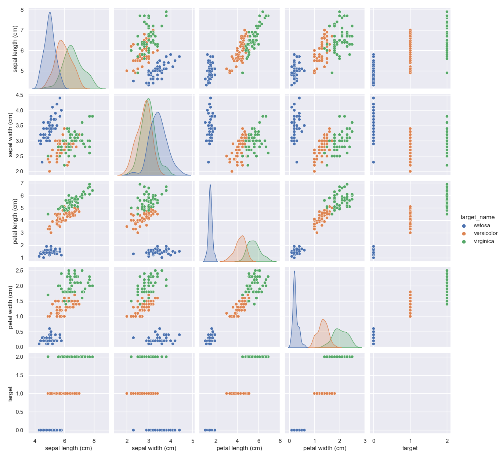


&nbsp;
#### Box Plot
The program for the following plots can be found under [boxplots.py](https://github.com/john-cashman/Pands-Project2021/blob/main/boxplots.py).
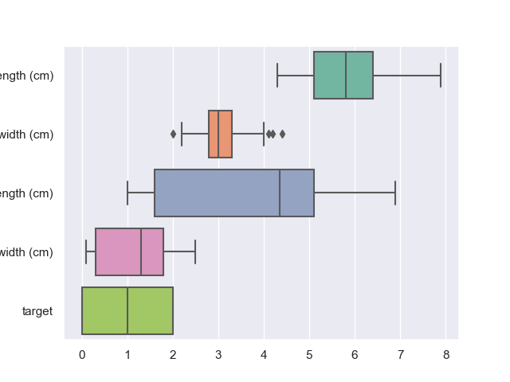


&nbsp;
#### Violin Plot
The program for the following plots can be found under [violin.py](https://github.com/john-cashman/Pands-Project2021/blob/main/violin.py).

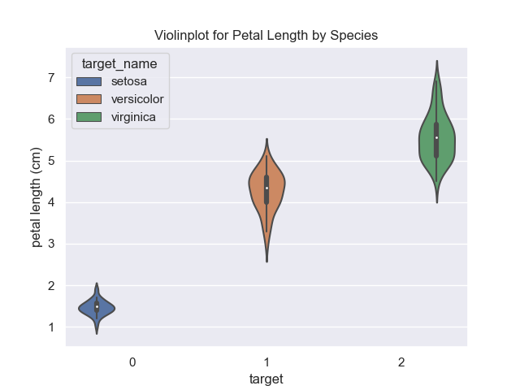

&nbsp;
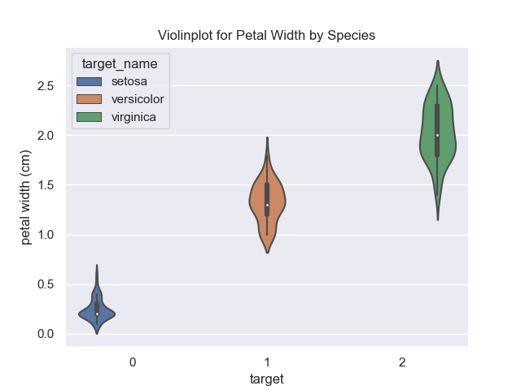

&nbsp;
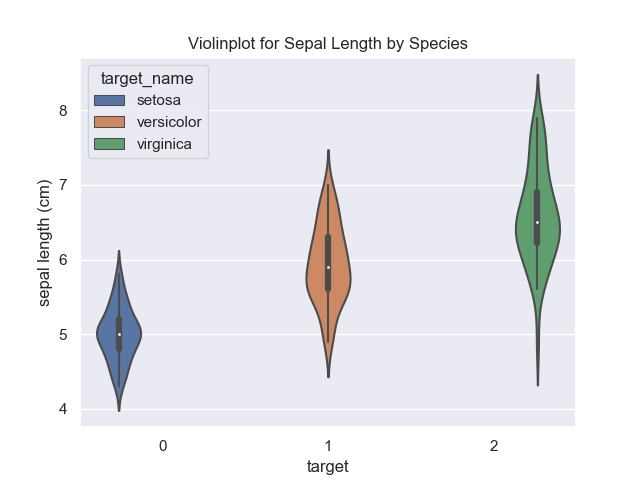

&nbsp;
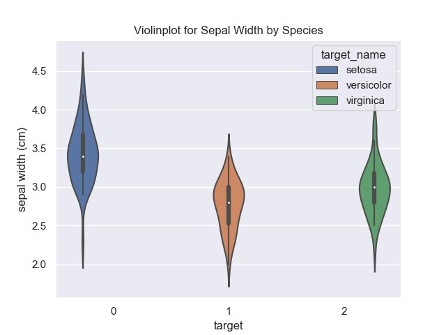


&nbsp;
#### lm Plot
The program for the following plots can be found under [lmplot.py](https://github.com/john-cashman/Pands-Project2021/blob/main/lmplot.py).


&nbsp;
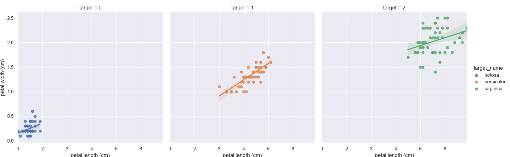


## Conclusion <a name="conclusion"></a>


*[source for image in introduction](https://www.oreilly.com/library/view/neural-network-programming/9781788390392/04622274-f10c-4930-a431-e5b0328c86ee.xhtml)
